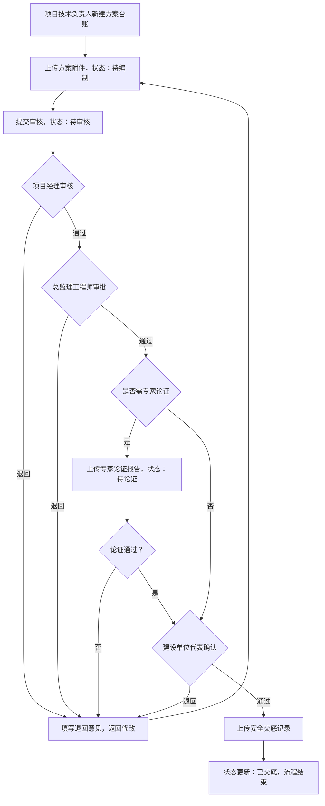

## 1. 产品概述

危大工程专项方案 Web 审批平台，服务于施工总包项目部、监理单位和建设单位三方，用于危大工程（深基坑、高支模、起重吊装等）专项方案的全生命周期管理与多方协同审批。通过数字化台账、可视化审批流和智能到期提醒，保障方案编制、审核、论证、交底各环节合规留痕，降低工程安全风险。

---

## 2. 核心功能

### 2.1 用户角色

| 角色 | 典型用户 | 核心权限 |
|------|----------|----------|
| 项目技术负责人 | 施工总包技术部 | 新建方案台账、填写工程参数、上传附件、提交审核 |
| 项目经理 | 施工总包项目部 | 审核方案要点、填写审批意见、签名确认或退回修改 |
| 总监理工程师 | 监理单位 | 审批方案合规性、填写监理意见、签名确认或退回 |
| 建设单位代表 | 建设单位工程部 | 最终审批方案、签署确认意见 |
| 全员视图 | 以上所有角色 | 查看提醒看板、浏览方案列表与审批历史 |

### 2.2 功能模块

1. **提醒看板首页**：按开工日期倒排的风险看板，突出显示三类待办——专家论证未完成、审批超期、交底未上传；支持项目例会逐项追踪。
2. **方案列表（台账）**：危大工程方案条目管理；支持按状态筛选（待编制 / 待审核 / 待论证 / 已交底）、新建条目、查看详情、上传附件。
3. **审批详情**：多方审批流视图，展示方案要点、逐节点审批记录（时间 + 签名 + 意见）、退回修改历史、方案附件预览下载、当前可执行的审批操作（通过 / 退回 / 上传交底）。

### 2.3 页面详情

| 页面名称 | 模块名称 | 功能描述 |
|----------|----------|----------|
| 提醒看板 | 顶部统计卡片 | 展示方案总数、待审批数、超期数、论证未完成数、交底未上传数 |
| 提醒看板 | 风险事项列表 | 按开工日期倒排，分三类风险标签展示，支持点击跳转审批详情 |
| 提醒看板 | 快捷入口 | 快速跳转到方案列表、新建方案 |
| 方案列表 | 状态筛选 Tab | 待编制 / 待审核 / 待论证 / 已交底 四个状态切换 |
| 方案列表 | 方案条目表格 | 显示工程类型、部位、规模参数、计划施工日期、编制人、当前状态、操作按钮 |
| 方案列表 | 新建方案弹窗 | 录入工程类型、部位、规模参数、计划日期、编制人、附件上传 |
| 审批详情 | 方案基本信息卡片 | 完整展示方案台账信息与附件 |
| 审批详情 | 审批流程时间线 | 竖向时间线展示各节点处理人、时间、签名、意见/退回原因 |
| 审批详情 | 修改记录 | 记录每次退回后的修改内容对比 |
| 审批详情 | 审批操作区 | 根据当前角色和审批节点显示「通过」「退回」「上传专家论证」「上传交底记录」等操作按钮 |

---

## 3. 核心流程

**方案审批主流程**：项目技术负责人新建方案条目 → 上传方案附件并提交审核 → 项目经理审核（可退回修改）→ 总监理工程师审批（可退回）→ 建设单位代表确认（如需专家论证则在监理环节后插入）→ 上传交底记录 → 方案归档为"已交底"。

---

## 4. 用户界面设计

### 4.1 设计风格

- **主色**：工程安全蓝 `#1E40AF`，传达专业与可靠
- **辅助色**：警示橙 `#F59E0B`（超期提醒）、风险红 `#DC2626`（论证未完成/紧急）、成功绿 `#059669`（已交底/通过）
- **中性色**：以 slate 灰阶构建，深灰文字 `#1E293B`，中灰边框 `#CBD5E1`，浅灰背景 `#F8FAFC`
- **按钮风格**：方形微圆角（`rounded-md`），实心主色按钮配白色文字，次要操作用 outlined 样式
- **字体**：标题使用「思源黑体 / Noto Sans SC」Bold，正文使用系统无衬线字体；字号层级 12/14/16/20/28
- **布局风格**：顶部导航栏 + 左侧菜单 + 右侧内容区的经典后台布局，卡片式模块分区，表格信息密度适中
- **图标风格**：Lucide React 线性图标，尺寸 16px/20px，与文字保持 4px 间距

### 4.2 页面设计概述

| 页面名称 | 模块名称 | UI 元素 |
|----------|----------|----------|
| 提醒看板 | 顶部统计卡片 | 5 张带图标的彩色统计卡，数字为主标题，描述为副标题，hover 有轻微浮起 |
| 提醒看板 | 风险事项列表 | 分组卡片列表，每组带风险标签（橙/红/黄），每条显示倒计时天数、工程名称、部位、状态标签 |
| 方案列表 | 状态筛选 Tab | 胶囊状 Tab，激活态为蓝底白字，带数量角标 |
| 方案列表 | 方案条目表格 | 斑马纹浅灰行，状态为彩色标签 Pill，操作列放查看/编辑按钮 |
| 方案列表 | 新建方案弹窗 | 居中大弹窗，表单两列栅格，必填项红星标注，底部"取消 / 保存"按钮 |
| 审批详情 | 方案基本信息卡片 | 白色卡片，左侧元信息（类型、部位、日期等），右侧附件列表（可下载） |
| 审批详情 | 审批流程时间线 | 竖向左侧时间线节点，节点为彩色圆点（绿通过/红退回/灰待处理），右侧展示处理人、时间、签名样式、意见文字 |
| 审批详情 | 审批操作区 | 底部固定操作栏（sticky），主按钮「通过」「上传交底」，次按钮「退回（带弹窗填写意见）」 |

### 4.3 响应式

- 桌面端优先（≥1280px），主内容区最大宽度 1440px 居中
- 平板端（768-1279px）：左侧菜单收起为图标栏，表格允许横向滚动
- 移动端（<768px）：顶部导航折叠为汉堡菜单，卡片堆叠展示，时间线保持竖向

### 4.4 动画与动效

- 页面首次加载：顶部统计卡 4 张依次淡入上移（stagger 100ms）
- 状态标签切换：Tab 下划线滑动过渡 200ms ease
- 弹窗打开：背景蒙层淡入 + 弹窗 scale(0.96→1) 150ms ease-out
- 审批操作点击：按钮按压缩放 0.97 反馈，成功后时间线节点插入动画
