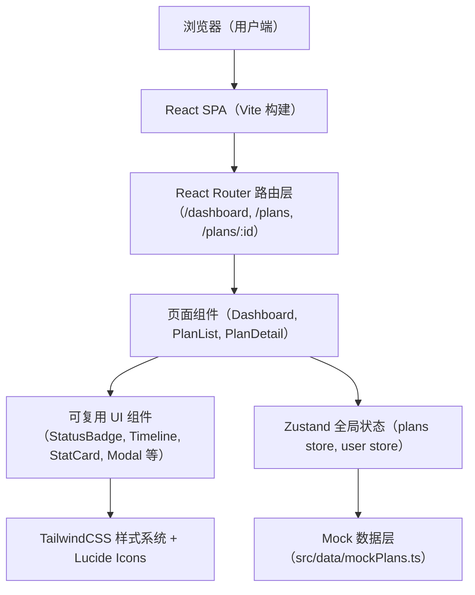
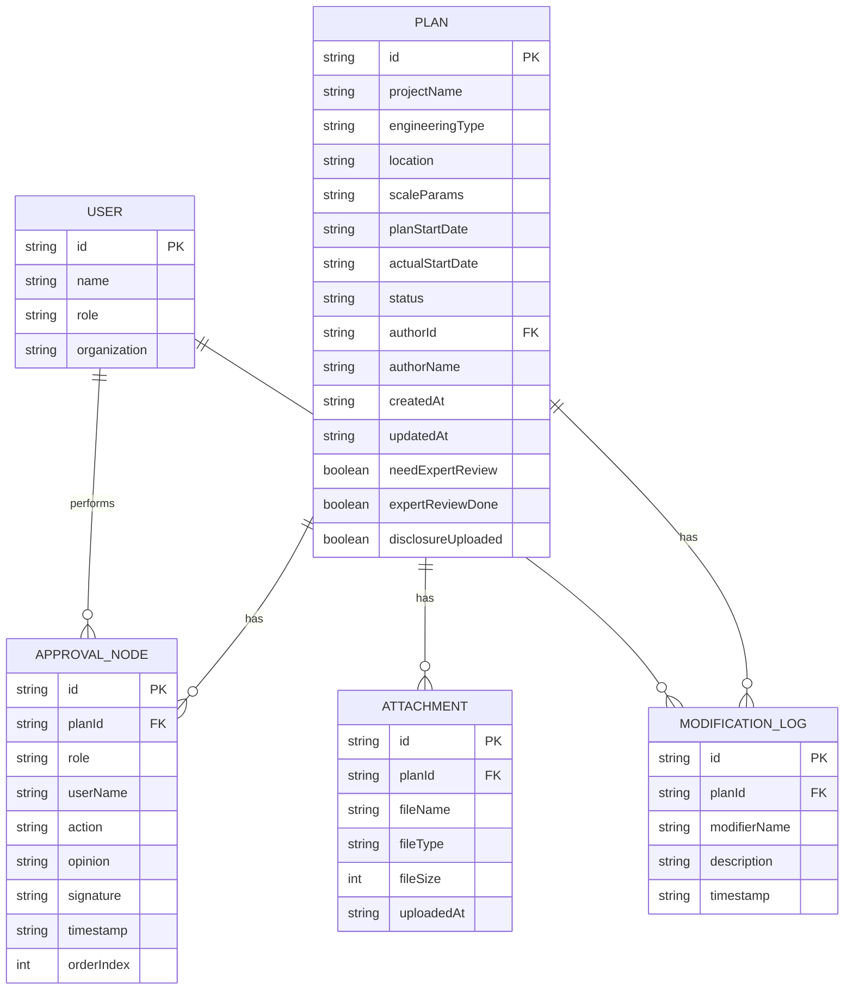

## 1. 架构设计

纯前端单页应用（SPA），使用 React 组件化开发，状态通过 Zustand 集中管理，模拟数据存储在本地 mock 文件中。路由由 react-router-dom 管理，三页面之间无缝切换。



---

## 2. 技术描述

- **前端框架**：React 18 + TypeScript
- **构建工具**：Vite 5
- **路由管理**：react-router-dom 6
- **状态管理**：Zustand 4
- **样式方案**：TailwindCSS 3（原生 CSS 变量主题化）
- **图标库**：lucide-react
- **后端/数据库**：无后端，所有数据使用前端 Mock（TypeScript 对象数组模拟），状态变更在内存中保存
- **初始化模板**：react-ts（纯前端）

---

## 3. 路由定义

| Route | 页面 | 用途 |
|-------|------|------|
| `/` | Dashboard（提醒看板） | 首页，展示到期提醒、风险事项、统计概览 |
| `/plans` | PlanList（方案列表） | 方案台账管理，状态筛选，新建方案 |
| `/plans/:id` | PlanDetail（审批详情） | 审批流程时间线、方案信息、审批操作 |

---

## 4. 数据模型

### 4.1 实体关系



### 4.2 核心类型定义（TypeScript）

```typescript
type PlanStatus = 'draft' | 'pending_review' | 'pending_argument' | 'disclosed';

interface Plan {
  id: string;
  projectName: string;
  engineeringType: '深基坑' | '高支模' | '起重吊装' | '脚手架' | '拆除爆破' | '其他';
  location: string;
  scaleParams: string;
  planStartDate: string;
  actualStartDate?: string;
  status: PlanStatus;
  authorName: string;
  createdAt: string;
  updatedAt: string;
  needExpertReview: boolean;
  expertReviewDone: boolean;
  disclosureUploaded: boolean;
  attachments: Attachment[];
  approvalNodes: ApprovalNode[];
  modificationLogs: ModificationLog[];
}

interface ApprovalNode {
  id: string;
  planId: string;
  role: '项目技术负责人' | '项目经理' | '总监理工程师' | '建设单位代表' | '专家论证';
  userName: string;
  action: 'pending' | 'approved' | 'rejected';
  opinion?: string;
  signature?: string;
  timestamp?: string;
  orderIndex: number;
}

interface ModificationLog {
  id: string;
  planId: string;
  modifierName: string;
  description: string;
  timestamp: string;
}

interface Attachment {
  id: string;
  fileName: string;
  fileType: string;
  fileSize: number;
  uploadedAt: string;
}
```

---

## 5. 前端目录结构

```
src/
├── components/          # 可复用 UI 组件
│   ├── Layout.tsx       # 整体布局（导航 + 侧边栏 + 内容区）
│   ├── StatCard.tsx     # 统计卡片
│   ├── StatusBadge.tsx  # 状态标签
│   ├── ApprovalTimeline.tsx  # 审批时间线
│   ├── RiskItemCard.tsx # 风险事项卡片
│   ├── PlanTable.tsx    # 方案列表表格
│   ├── NewPlanModal.tsx # 新建方案弹窗
│   ├── RejectModal.tsx  # 退回意见弹窗
│   └── AttachmentList.tsx   # 附件列表
├── data/
│   └── mockPlans.ts     # Mock 数据
├── hooks/
│   └── useCurrentUser.ts    # 当前用户钩子
├── pages/
│   ├── Dashboard.tsx    # 提醒看板首页
│   ├── PlanList.tsx     # 方案列表
│   └── PlanDetail.tsx   # 审批详情
├── store/
│   └── usePlanStore.ts  # Zustand 状态管理
├── types/
│   └── index.ts         # 全局类型定义
├── utils/
│   └── dateUtils.ts     # 日期工具函数
├── App.tsx
├── main.tsx
└── index.css
```

---

## 6. 主题与颜色变量（TailwindCSS 扩展）

```js
// tailwind.config.js 扩展
theme: {
  extend: {
    colors: {
      brand: {
        50: '#EFF6FF',
        100: '#DBEAFE',
        500: '#3B82F6',
        600: '#1E40AF',
        700: '#1E3A8A',
      },
      risk: {
        red: '#DC2626',
        orange: '#F59E0B',
        yellow: '#EAB308',
        green: '#059669',
      },
    },
    fontFamily: {
      sans: ['"Noto Sans SC"', '"PingFang SC"', 'system-ui', 'sans-serif'],
    },
  }
}
```
